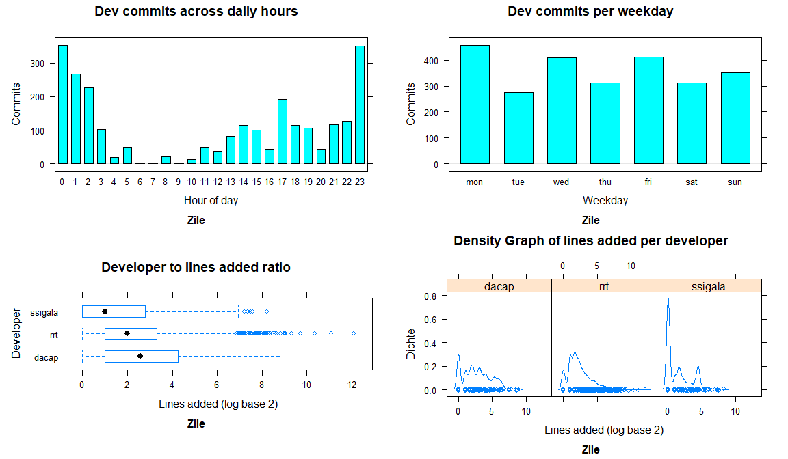

# Sheet 3
### Abgabe:

## 3-1
### (c)
```r
> junit20 = myread.csvdata("src/data/junit20.tsv")
> mode(junit20$tstamp2)
[1] "numeric"
> class(junit20$tstamp2)
[1] "POSIXct" "POSIXt"
> junit20$tstamp2
 [1] "2004-11-17 23:07:28 UTC" "2002-09-01 00:29:52 UTC"
 [3] "2002-08-31 18:44:09 UTC" "2002-08-23 20:43:51 UTC"
 [5] "2001-05-21 21:50:15 UTC" "2001-04-08 02:18:42 UTC"
 [7] "2001-04-01 23:22:15 UTC" "2001-01-17 01:02:18 UTC"
 [9] "2001-01-10 00:39:50 UTC" "2000-12-03 15:36:14 UTC"
[11] "2000-12-03 15:36:14 UTC" "2004-11-17 23:47:23 UTC"
[13] "2004-11-13 01:33:00 UTC" "2002-08-31 18:44:09 UTC"
[15] "2002-08-23 20:43:51 UTC" "2002-02-14 21:58:36 UTC"
[17] "2002-02-07 00:43:07 UTC" "2002-02-06 22:12:01 UTC"
[19] "2002-02-06 21:42:19 UTC" "2001-05-21 21:50:15 UTC"
> junit20$tstamp2[1]
[1] "2004-11-17 23:07:28 UTC"
> junit20$tstamp2[2]
[1] "2002-09-01 00:29:52 UTC"
> junit20$tstamp2[1] - junit20$tstamp2[2]
Time difference of 808.9428 days
> junit20$tstamp2[2] - junit20$tstamp2[1]
Time difference of -808.9428 days
> class(junit20$tstamp3)
[1] "numeric"
> mode(junit20$tstamp3)
[1] "numeric"
> junit20$tstamp3
 [1] 1100732848 1030840192 1030819449 1030135431  990481815  986696322
 [7]  986167335  979693338  979087190  975857774  975857774 1100735243
[13] 1100309580 1030819449 1030135431 1013723916 1013042587 1013033521
[19] 1013031739  990481815
> junit20$tstamp2 - junit20$tstamp3
 [1] "1970-01-01 UTC" "1970-01-01 UTC" "1970-01-01 UTC" "1970-01-01 UTC"
 [5] "1970-01-01 UTC" "1970-01-01 UTC" "1970-01-01 UTC" "1970-01-01 UTC"
 [9] "1970-01-01 UTC" "1970-01-01 UTC" "1970-01-01 UTC" "1970-01-01 UTC"
[13] "1970-01-01 UTC" "1970-01-01 UTC" "1970-01-01 UTC" "1970-01-01 UTC"
[17] "1970-01-01 UTC" "1970-01-01 UTC" "1970-01-01 UTC" "1970-01-01 UTC"
```

tstamp2 is a POSIXct object using the following structure for each element: "y-m-d h:m:s UTC"  
tstamp3 is a numeric value in seconds, which is added on the base date of 1.1.1970. The tstamp3  
elements represent the same date index-wise as the tstamp2 elements do, e.g.   
junit20$tstamp3[1] = 1100732848 = "2004-11-17 23:07:28 UTC" = junit20$tstamp2[1].  
The result of junit20$tstamp2[1] - junit20$tstamp2[2] is a time difference of 808.9428 days.  
We could also subtract the larger date from the smaller date, which would result in a time
difference of -808.9428 days.  
For the subtraction junit20$tstamp2 - junit20$tstamp3 we are not  
surprised that the result is always the base date of 1.1.1970 because  
we subtract the same values
from each other, which are given in 2 different formats.

## 3-2
### (a, b, c) Plots per project
How to get all 4 plots in one window per project (4 windows in total):  
NOTE: All plots were created with lattice instead of R default plots to be able to put them 
all in a grid.
```r
> myplot.test()
```

We can see that on the Jikes project, commits occur throughout the day, every day.
There's lower commit counts during lunchtime (11:00-13:00) and slightly less on sundays.  <br /><br />

On average, devs who add more lines also delete more lines. (as seen on both boxplot figures).  
  
<br />
<br />
<br />
<br />


Developers seem to start to commit starting from 10:00 daily and stop around 3:00 to 5:00. Most activity is late at night between 23:00 and 2:00.
The weekly commit behavior stays mostly the same.

While rrt and dacap seem to have very similar lines added to lines deleted behavior, ssigala seems to add much more lines than they delete.
<br />
<br />
<br />
<br />

On the JUnit project commits mostly happen at around 15:00 and between 23:00 and 01:00. Most of the activity happens on sundays.


<br />
<br />
<br />
<br />

Since this dataset is mostly about one developer who has more than 80% of contributions, we are seeing the development behaviour of this one developer [egamma] (for this project).  
They seem to work on this project every weekday except for tuesdays (0 commits).
Commits happen strictly between 15:00 and 2:00 (with breaks between 16-18 and on 19-20).


<br />
<br />

### (d) Participation plots


How to get all plots in one image (window):
```r
> myplot.participation.test()
```

We can see on zile that ~80% of contributions (lines added, deleted and commit count) was done
by just one developer which we can classify as lead developer(?).

For Jikes, which has the highest individual count (8), we see that the lead developer amounts
for ~70% of lines added and deleted, but only 45% of commits. So we can conclude that many of
the remaining contributors have worked on small issues and minor changes while the first 3 devs
are working on over 80% of the codebase and 90% of the lines added and deleted.

JUnit has the highest diversity in participation: The lead developer has the highest commit count
(over 60%), but only amounts for less than 50% of lines added and just above 50% of lines deleted.
But even in this case the two most active devs have over 80%  total contribution and slightly over
70% of lines added and deleted. So ~30% of devs amount for over 70% of the work.

Junit20 is a very small sample size compared to the other projects and it basically looks like
it's a single developer doing over 80% of the work.

Interpretation of all results:
From the given open source projects we can conclude that the most active 1-3 developers in a project
amount for at least 70% of the work being done. This is true for commit count, total lines added and
total lines deleted. However given the small sample size (4 projects) and also the small amount of
developers (4.5 on avg, minimum of 2 and maximum of 8) we don't know if this would be true for bigger
oss projects (in terms of dev count).
